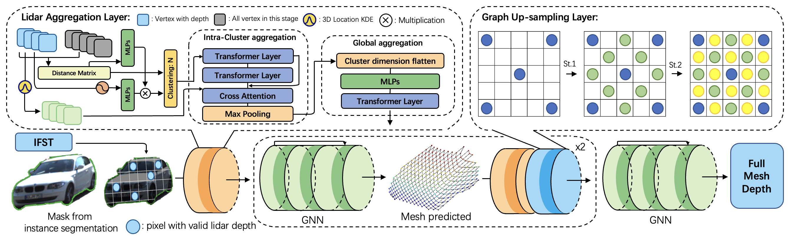

# WYSIWYD

<p align="center">  </p>
The official codes implementation for the paper 
"What You See Is What You Detect: Towards Better Object Densification in 3D Detection".
We first released the augmented lidar signal for performance open review. 
The codes to generate added points will be released after the paper get accepted.

We now provide pre-trained weights for Voxel-RCNN and the augmented lidar points.
Our paper will be available on ArXiv soon.

## Performance verification
1.  Prepare for the running environment. 

    Please follow docker image provided by [`Voxel-R-CNN`](https://github.com/djiajunustc/Voxel-R-CNN) to setup your environment.

2. Replace the configuration files provided 

    Please download the related weights and files the following links, depend on you are in China or not. 
    - [`Baidu Cloud`](https://pan.baidu.com/s/1Fr8WHcjjLmLLohcSCXIGhQ?pwd=hqtc)
   or 
    - [`OneDrive`](https://uottawa-my.sharepoint.com/personal/tliu157_uottawa_ca/_layouts/15/guestaccess.aspx?share=Eo3E71Zo0mhDlvNuGHFGeygB8ZxNgMXufEbYfTRBdhmn_A&e=6H02Hp)  
    You need to change the 'get_lidar' function in pcdet/datasets/kitti/kitti_dataset.py around line 70 by
    ```
   lidar_file = self.root_split_path / 'velodyne_fop_aug' / 'velodyne_fop_only_car_ped_-1' / ('%s.bin' % idx)
   ```
3. Your dataset dir should looks like follows:
     ```
        WYSIWYD
        ├── data
        │   ├── kitti
        │   │   │── ImageSets
        │   │   │── training
        │   │   │   ├──calib & velodyne & label_2 & image_2 & (optional: planes) & velodyne_fop_only_car_ped_-1
        │   │   │── testing
        │   │   │   ├──calib & velodyne & image_2
        │   │   │── gt_database
        │   │   │── kitti_infos_test.pkl
        │   │   │── kitti_infos_train.pkl
        │   │   │── kitti_infos_trainval.pkl
        │   │   │── kitti_infos_val.pkl
        ├── pcdet
        ├── tools
       ```
4. Inference specific weights
    ```
   python tools/test.py --cfg_file /path_to_yaml_file/voxel_rcnn_3classes.yaml
    --batch_size 8
    --workers 8
    --ckpt /path_to_weight/main_res.pth
   ```

5. Train model with the provided lidar data

    Please take the YAML file provided for an inference, cancel the GT-Sampling in the training pipeline will
    be better for performance.

With the main_res.pth, the result should like follows. You can check the further result from our paper.
```
Car AP_R40@0.70, 0.70, 0.70:
bbox AP:98.9053, 95.9023, 93.4399
bev  AP:95.6424, 91.8239, 89.5842
3d   AP:92.6015, 85.8442, 83.4265
aos  AP:98.87, 95.71, 93.15

Pedestrian AP_R40@0.50, 0.50, 0.50:
bbox AP:80.4118, 78.1586, 71.7518
bev  AP:80.0973, 75.2514, 68.6998
3d   AP:75.5632, 69.3826, 64.5597
aos  AP:37.56, 37.52, 34.45
```

## Acknowledge
Our future released codes are based on [`OpenPCDet`](https://github.com/open-mmlab/OpenPCDet) 
and some parts of the code were designed with reference to [`Pixel2Mesh`](https://github.com/nywang16/Pixel2Mesh)